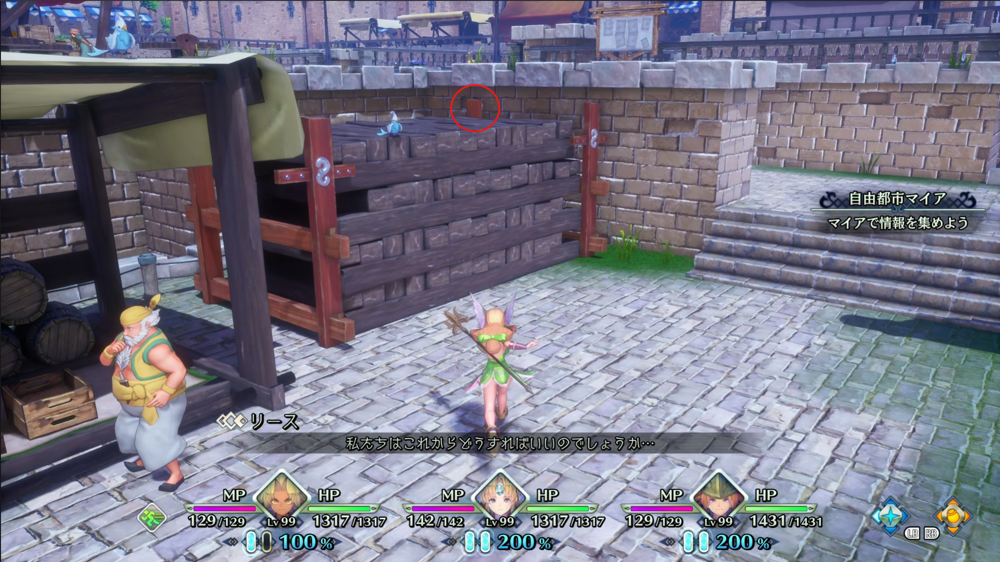

# 聖剣伝説3 TRIALS of MANA NG+ Expert (ベリーハード) リケデ

カエル候さんのチャートをベースに、自分の走りやすさと安定性を重視するようにしたチャート

`スワップ`と書いてないところは通常必殺技

書き間違えとか抜け漏れとかあるかも

分岐があるところはどちらが早いか検証してない

## メンバー

- 主人公：リース
- 仲間1：ケヴィン
- 仲間2：デュラン

## 事前準備

（準備するアイテム、武器、アビリティについて書きたい）

## チャート

ファイル2に引継ぎセーブデータをセーブ

主人公：リース、仲間1：ケヴィン、仲間2：デュランを選択

「レベルのリセットをおすすめします」で「いいえ」を選択し、決定した瞬間からタイマースタート

### オープニング

チビデビルの瞳→ロック→弱攻撃

装備
- サボテンソウル
- 混沌の加護
- ラビのスリッパ

### ラビの森

2回目に滝の洞窟へ向かう時、ケヴィンとの会話後にクラス1突進攻撃でフェアリーイベントをカット

クラス1突進攻撃時にリングコマンドを開いたときに下記をショートカット登録
- リース：パンプキンボム（右）、騎竜の鎖（下）、ブリーシンガメン（左）、魔法のロープ（上）
- ケヴィン：魔法のロープ（上）、まんまるドロップ（左）、夢見草（下）

### 滝の洞窟

リースで最初のラビに攻撃→バットムの下に移動→バットムが超音波を放つと同時にリースショトカでパンプキンボム

金の女神像の前に来たら（Battle Result表示が消えたら）魔法のロープを多重登録

ケヴィンに力MAX振り、下記を装備
- 強気Ⅲ
- 弱点特攻Ⅱ
- バンパイアクロー
- ラビのスリッパ

金の女神像でファイル2にセーブ

右に進み、リースかケヴィンでスライドジャンプし、下に降りてシャルロットイベントをカット

出口前に着いたら、ケヴィンショトカで夢見草→リースにキャラチェン→前に進む

光の司祭と会話後、`オートセーブ`の表示が出たら魔法のロープ

シャルロットの横をジャンプしてシャルロットとの会話をカット

滝でフェアリーと会話後、2歩→ローリング移動→マップ遷移時にローリング

フルメタルハガー前ショートカット場所に着いたらリースでスライドジャンプ

ケヴィンでフルメタルハガー戦に入る

#### フルメタルハガー

暗転中にローリング→もう一度ローリング→無想阿修羅拳

ダイブアタックが来たらワンパンできないことがある

### ジャド

イベントシーンが終わったらケヴィンショトカで魔法のロープ

左スティックを下に入れたまま決定ボタンを連打して外に出る

### マイア

4歩直進→下記赤丸に向かって2歩→ジャンプ→弱攻撃 で木箱の上に乗る  

ボンボヤジと会話した後、道具屋の横にあるはしごの所でスライドジャンプして建物の上に乗り、ところがだおじさんとの会話をカット  
（はしごのすぐ横にあるレンガの壁に向かってスライドジャンプする感じで）

### 黄金の街道

後ろに**2.5**歩→バグロープ仕込み→魔法のロープ→左スティックを左下に入れたまま4回ローリング

### 大地の裂け目

ケヴィンで吊り橋の3枚目の板の上に乗る→ショトカで夢見草→デュランにキャラチェン→前に進む

#### マシンゴーレムR

デュランがケヴィンにセイレーンの爪→ケヴィンにキャラチェン→無想阿修羅拳→橋の真ん中まで反対側のゴーレムに近づいて無想阿修羅拳

### 黄金の街道

後ろに**2.5**歩→バグロープ仕込み→魔法のロープ→左スティックを左下に入れたまま4回ローリング

### ドワーフのトンネル

後ろに**2**歩→バグロープ仕込み

ワッツに話しかけたら魔法のロープ

リースでジュエルイーター戦に入る

#### ジュエルイーター

ショトカで騎竜→ケヴィンにキャラチェン→デュランがケヴィンにセイレーンの爪→弱×3して無双阿修羅拳→弱×2して無双阿修羅拳

### 大地の裂け目

黄金の街道側入り口へ育成スタック→オートセーブ：大地の裂け目をロード→ドワーフの村側入り口へ育成スタック→オートセーブ：黄金の街道をロード

### 黄金の街道

魔法のロープでマイア入り口側へ

### マイア

後ろに**2.5**歩（歩きすぎると出てしまう）→仲間で魔法のロープを使ってバグロープ仕込み

### モールベアの高原

到着後魔法のロープでフォルセナ城入り口側へ

### フォルセナ城～マイア

そのまま進む

### 黄金の街道

後ろに**2.5**歩→バグロープ仕込み→魔法のロープ

バイゼル入り口に着いたらケヴィンショトカで夢見草→リースにキャラチェン→前に進む

### パロ

そのまま進む

### 天かける道

1つ目のショートカットでスライドジャンプ

2つ目のショートカットはジャンプ弱弱ローリングで登る

### ローラント秘密のアジト

そのまま進む

### バイゼル

大砲演出をスキップ後、2歩進む→階段の手すり方向に向く→手すりに向かってジャンプで手すりに乗る→屋根に乗る

### ジャド→コロボックルの村→ジャド

そのまま進む

### パロ

到着後魔法のロープ→天かける道入り口側へ  
（ロード時間によっては遅くなるかもしれない）

### 天かける道

ショートカットは最初と同じ

橋を渡り銀の女神像に触る

風の回廊入り口で育成スタック→オートセーブ：天かける道をロード→風の回廊のマナストーン側金の女神像前へ

### 風の回廊

リースでジャンプ弱ローリングでマナストーンイベントをカット

クラスチェンジ
- リース：フェンリルナイト
- ケヴィン：デルヴィッシュ
- デュラン：ソードマスター

作戦変更
- デュラン：援護のみ
- ケヴィン：援護のみ
- リース：特技・必殺技OFF

育成ポイント
- リース：力MAX、知性MAX、精神27
- ケヴィン：力MAX
- デュラン：力MAX、知性MAX、精神27

装備・アビリティ変更（書いてないところはそのまま）
- デュラン：アタックセイバー、アタックセイバーⅡ、攻乃型、弱点特攻、弱点特攻オール、闇の力、ラグナロク、風の神獣リング
- リース：巨人の槍、風の神獣リング、ダウンSP+、ペイバック、ダウン強化、ダウン強化Ⅱ
- ケヴィン：ギガースグローブ、裁定者、アタッカー、獣の咆哮、本能の絆

ケヴィンでツェンカー戦へ

#### ツェンカー

開幕後、スワップ水月→リースにキャラチェン→デュランショトカ左にダイヤセイバー登録して指示→リースショトカで騎竜→リースショトカでブリー→旋風槍（確定ワンパンじゃない）

撃破後、魔法のロープ

### 天かける道

銀の女神像でファイル3にセーブ

### ローラント城

リースでジェノア戦へ

#### ジェノア

リースショトカで騎竜→ケヴィンにキャラチェン→デュランでケヴィンにポセイドンの爪指示→1回ローリングして水月

ケヴィンでビルベン戦へ

#### ビルベン

スワップ水月→リースにキャラチェン→リースショトカで騎竜→スワップ百花→近づいてデュランで弱2強→ケヴィンで殴る

### 天かける道

後ろに**2**歩→バグロープ仕込み→魔法のロープ

### 幽霊船

#### 強制戦闘

開幕後、旋風槍

リースでゴーヴァ戦へ

#### ゴーヴァ

リースショトカで騎竜→ケヴィンにキャラチェン→リースに聖騎士指示→近づいて水月スワップ→リースショトカでブリー→近づいて攻撃、遠かったらクラス1必殺技

回転攻撃のとき、ワンパンできなかったらリースはその場にいて、回ってきたところを攻撃する or 避けて攻撃

### 火山島ブッカ

そのまま進む

### フォルセナ

ぴーひゃら笛をリースショトカ右に登録

フォルセナ城内金の女神像でファイル1にセーブ

ファイル2：滝の洞窟のセーブデータをロード

### 滝の洞窟

ラビの森側入り口へ育成スタック→ファイル1：フォルセナのセーブデータをロード

### フォルセナ

目の前の金の女神像でファイル1にセーブ（ラビの森のセーブデータになる）→ファイル1：ラビの森のセーブデータをロード

### ラビの森

海岸からサルタンへ

### サルタン

そのまま進む

### 灼熱の砂漠

看板前に着いたら、ケヴィンショトカでまんまるドロップ→リースにキャラチェン→弱攻撃→リングでまんまるドロップ→攻撃モーションが終わるときに決定連打

火炎の谷側入り口へ育成スタック→ファイル1：ラビの森のセーブデータをロード

### ラビの森

目の前の金の女神像でファイル2にセーブ（火炎の谷のセーブデータになる）→海岸からエルランドへ

### エルランド

零下の雪原側入り口へ育成スタック→ファイル2：火炎の谷のセーブデータをロード

### 火炎の谷

マナストーン前のイベントまでにケヴィンにキャラチェン

マナストーン前のイベント後、ケヴィンショトカで魔法のロープ→振り向く→灼熱の砂漠側入り口へ育成スタック→オートセーブ：零下の雪原をロード

### 零下の雪原

魔法のロープ→氷壁の迷宮へ

### 氷壁の迷宮

そのまま進む

### 零下の雪原

氷壁の迷宮側金の女神像でファイル2にセーブ→ファイル1：ラビの森のセーブデータをロード

### ラビの森

海岸からミントスへ

### ミントス

魔法のロープ→月夜の森側入り口へ育成スタック→ファイル2：零下の雪原のセーブデータをロード

### 零下の雪原

目の前の金の女神像でファイル2にセーブ（月夜の森のセーブデータになる）→ファイル2：月夜の森のセーブデータをロード

### 月夜の森

後ろに**3.5**歩→ロープ仕込み→ミントス側入り口へ育成スタック→オートセーブ：月読みの塔をロード

### 月読みの塔

ケヴィンでルガー戦へ

#### ルガー

暗転中にロック→スワップ水月→リースにキャラチェン→デュランにフレイムセイバーをショトカ下登録して指示→リースショトカで騎竜→リースショトカでブリー→スワップ百花→（水月が終わったタイミングで）スワップ真空剣→ケヴィンで殴る

マナストーン前のイベントまでにリースにキャラチェン

マナストーン前のイベント後、オートセーブ：ミントスをロード

### ミントス

裏側の世界の道具屋？のドアに入る→海岸からランプ花の森へ

### ランプ花の森

入り口のイベント後、魔法のロープ→ディオールへ

### ディオール

シャルロットのおじいちゃんと会話後、`オートセーブ`の表示が出たら魔法のロープ

### ランプ花の森

振り向き→バグロープ仕込み→銀の女神像前のイベントまでにケヴィンにキャラチェン

#### ギルダーバイン

本体にスワップ水月→リースショトカで騎竜→デュランショトカでフレイムセイバー→リースショトカでブリー→形態変化中に雑魚敵を倒す→デュランを本体から一番奥に配置→ケヴィンを真ん中に配置→リースで真ん中に移動→形態変化が終わりそうになったらスワップ真空剣→頭が下がったらスワップ百花→ケヴィンで殴る

リースにキャラチェン→魔法のロープ→海岸でぴーひゃら笛

### 天かける道

パロ側入り口でバグロープ仕込み→魔法のロープ

### 天の頂

そのまま進む

#### マナの聖域

ぴーひゃら笛を外す

風の太鼓を多重登録して、リース・ケヴィンのショトカ右に登録

### ワンダーの樹海

てきとーにアスレチックする

ケヴィンで入る

#### ミスポルム

暗転中から2回ローリングして近づきスワップ水月→リースにキャラチェン→デュランにサンダーセイバーをショトカ上登録して指示→デュランに騎竜指示→リースショトカでブリー→近づいてスワップ百花→近づいてスワップ真空剣→弱×3強して水月

### 氷壁の迷宮

氷壁の迷宮入り口にバグロープ仕込み→氷壁の迷宮側金の女神像に触る→オートセーブをロード

ケヴィンで入る

#### フィーグムンド

開幕後、スワップ水月→リースショトカで騎竜→デュランショトカでフレイムセイバー→リースショトカでブリー→スワップ百花→（水月が終わったタイミングで）スワップ真空剣→ケヴィンで脚の近くまで歩いて殴る

### 灼熱の砂漠

火炎の谷側入り口にバグロープ仕込み→火炎の谷側金の女神像に触る→オートセーブをロード

ケヴィンで入る

#### ザンビエ

開幕後、スワップ水月→リースショトカで騎竜→デュランショトカでダイヤセイバー→リースショトカでブリー→水月のダメージが入ってからスワップ百花→スワップ真空剣→ケヴィンで殴る

### 灼熱の砂漠

火炎の谷側金の女神像でファイル1にセーブ→ファイル2：月夜の森をロード

### 月夜の森

後ろに**2**歩→育成スタック→ファイル1：灼熱の砂漠をロード

### 灼熱の砂漠

目の前の金の女神像に触る→オートセーブ：月読みの塔をロード

### 月読みの塔

リースでドラン戦へ

### ドラン

#### 赤範囲が縦からのとき

リースショトカで騎竜→ケヴィンにキャラチェン→デュランに何かセイバー指示
→リースにブリー指示
→ケヴィンで2回ローリング→クラス3コンボ×2→
- クラス2コンボ
- クラス3コンボ

→スワップ水月→リースにキャラチェン→クラス2コンボ→スワップ百花→デュランにキャラチェン→近い方の壺を弱強で割る→スワップ真空剣→ケヴィンでリースが空くまで殴る→スワップ飛天槍→ケヴィンで殴る

#### 赤範囲が横からのとき

リースショトカで騎竜→ケヴィンにキャラチェン→デュランに何かセイバー指示→リースにブリー指示→ケヴィンで2回ローリング→クラス3コンボ×2→クラス3コンボ（これの要否検証したい）→スワップ水月→リースにキャラチェン→クラス2コンボ→スワップ百花→デュランにキャラチェン→近い方の壺を弱強で割る→スワップ真空剣→ケヴィンでリースが空くまで殴る→スワップ飛天槍→ケヴィンで殴る

### 光の古代遺跡

ネコちゃんに話しかける

リースでライトゲイザー戦へ

#### ライトゲイザー

デュランに闘士の証指示→リースショトカで騎竜→リースショトカでブリー→落ちてきたらスワップ水月→スワップ百花→デュランで弱×4強→ケヴィンで殴る→移動したらスワップ真空剣→ガイズブラストが始まったらスワップ水月→リースで弱×4強→スワップ旋風槍→ケヴィンで殴る

### 灼熱の砂漠

火炎の谷側金の女神像でファイル1にセーブ→ファイル3：天かける道をロード

### 天かける道

魔法のロープ→振り向き→育成スタック→ファイル1：灼熱の砂漠をロード

### 灼熱の砂漠

目の前の金の女神像に触る→オートセーブ：風の回廊をロード

### 風の回廊

ケヴィンでダンガード戦へ

#### ダンガード

（あんまり検証できてない）

初手振り回しの場合、リースに騎竜とブリー指示、デュランにダイヤセイバー指示

初手振り回しでない場合、リースにブリー指示、デュランにダイヤセイバー指示

### モールベアの高原

ドリアン側入り口にロープ仕込み→段を降りた先にある金の女神像に触る→オートセーブ：ドリアンをロード

リースでランドアンバー戦へ

#### ランドアンバー

リースで左手に弱スワップ百花→ケヴィンでスワップ朱雀→デュランショトカでサンダーセイバー→デュランで赤枠の上に移動→デュランにマタンゴの油→魔法を反射したらリースにキャラチェン

### ペダン

そのまま進む

### 暗闇の洞窟

フラミー降下後、中に入って階段を上ったところの右奥でパートナージャンプ

ケヴィンショトカで夢見草→前に進む

#### ゼーブル・ファー

スワップ水月→リースにキャラチェン→デュランに聖騎士指示→リースショトカで騎竜→スワップ百花→デュランでSP壺割る→ケヴィンにキャラチェン→デュランにブリー指示

再生後、スワップ朱雀→リースショトカで騎竜→デュランにキャラチェン→左右を倒したらスワップ真空剣→（朱雀が終わったタイミングで）スワップ百花→ケヴィンで殴りながらスワップ十文字

進んだ先の邪心像でゲートを開ける

リースで邪眼の伯爵戦へ

#### 邪眼の伯爵

右に進みながらリースショトカで騎竜→デュランショトカでダイヤセイバー→リースにブリー指示→ケヴィンで雑魚敵を倒す→弱×4強スワップ水月→弱×4強スワップ百花→弱×4強スワップ十文字→ケヴィンで弱×4強→ジャンプ強スワップ水月→弱×4強スワップ真空剣→リースでケヴィンが空くまで殴る→ケヴィンで殴る

ゴーストゲインがくるとたぶん完封できない

ダークキャッスル側入り口にバグロープ仕込み→デュランにキャラチェン→ゲート開けた先の金の女神像に触る→オートセーブ：ダークキャッスルをロード

### ダークキャッスル

デュランでフルメタルハガー2戦へ

#### フルメタルハガー2

スワップ真空剣→リースにキャラチェン→ケヴィンに闘士の証指示→スワップ百花→ケヴィンにキャラチェン→リングで騎竜→リングでブリー→ケヴィンで殴る

ダウンして片目が潰れたらスワップ水月→リースにキャラチェン→リースの硬直がとけたら旋風槍→デュランで殴る→（ダメージ足りてなかったらケヴィンで殴る）

ケヴィンでジェノア2戦へ

#### ジェノア2

スワップ水月→リースにキャラチェン→デュランにアイスセイバー指示→リースショトカで騎竜→リースショトカでブリー→スワップ百花→（水月が終わったタイミングで）スワップ真空剣→
- スワップ水月しながらデュランで殴る
- ケヴィンで殴る

最初に吹き飛ばしが来ないときはパワーアップかプロテクトアップされてる

プロテクトアップされたらもう一度騎竜

#### ツェンカー2

スワップ水月→リースショトカで騎竜→デュランショトカでダイヤセイバー→リースショトカでブリー→スワップ百花→ケヴィンで殴る→スーパーソニックが来たらスワップ真空剣→ケヴィンで殴る

撃破後、暗転が終わる前にデュランにキャラチェン

リングにルーンの書と金狼の魂を登録

ケヴィンで美獣戦へ

#### 美獣

スワップ水月→リースにキャラチェン→デュランにダイヤセイバー指示→デュランにブリー指示→リースリングで騎竜→リースリングでリースに金狼→スワップ百花→デュランを壺の近くに移動→ケヴィンで弱×4強入れながらデュランリングでケヴィンに金狼→リースに騎竜指示→ジャンプ強スワップ水月→デュランで壺2つ割る→リースSP300超えたらスワップ百花→水月が終わったタイミングでスワップ真空剣→弱×4強水月

最初にバフ・デバフしている間に美獣の初手が何かを判断する

爪ひっかきの場合、逃げてから2回目のスワップ百花

頭突き突進の場合、バフ・デバフして壁際からスワップ真空剣

### マナの聖域

スライドジャンプして裏側を通りマナの樹のところへ

ケヴィンでアークデーモン戦へ

#### アークデーモン

デュランとリースにルーンの書指示→ケヴィンショトカにルーンの書登録し、ショトカ連打

暗転したらタイマーストップ！おつかれさまでした！
